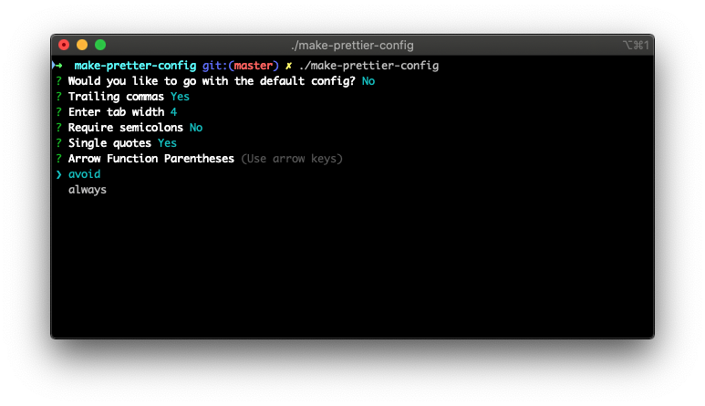

# make-prettier-config

Small binary to initialize prettier. By default prettier doesn't work unless you add something to your package json, make a config file manually or create a `.pretterrc` file. This binary asks a few questions and makes one for you. Simply drop it in your project folder and run `./make-prettier-config`.

To download: https://github.com/nol166/make-prettier-config/releases/

### Build

`yarn build`

### Issues

-   Releases are executable without running `chmod +x make-prettier-config`

## Todo:

-   create signed binaries
-   publish npm package
-   support multiple OSs

